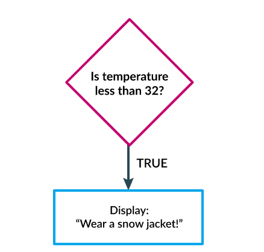

## Conditionals with if, else

Decisions are based on conditions

    Is `raining` -> take raincoat

Computer programs also make decisions, using **Boolean expressions** (true/false) inside **conditionals** (if/else).

### Example



```c
if(raining){
    printf("hello world");
}
```

### Syntax

```c
if (<condition>) {
    // instructions to be executed if the test expression is true
} else {
    // instructions to be executed if the test expression is false
}
```

The condition is a Boolean expression: an expression that evaluates to either true or false.

### How if statement works?

The `if` statement evaluates the test expression inside the parenthesis ().

- If the expression is evaluated to true,

  1. statements inside the body of if are executed.
  2. statements inside the body of else are skipped from execution.

- If the expression is evaluated to false,

  1. statements inside the body of if are not executed.
  2. statements inside the body of else are executed

> - Also called as branching
> - Also called as control statements (controls the flow of execution of a program.)

#### Comparison operators

| operator | Greater               | True Expressions |
| -------- | --------------------- | ---------------- |
| >        | Greater than          | 60 > 32          |
| >=       | Greater than or equal | 60 >= 32         |
| <        | Less than             | 20 < 32          |
| <=       | Less than or equal    | 20 <= 32         |
| ===      | Strict equality       | 32 === 32        |
| ==       | Equality              | 32 == 32         |
| !==      | Strict inequality     | 30 !== 32        |
| !=       | Inequality            | 30 != 32         |

### The else statement

To execute a different set of instructions when the condition is false, then we can use an else statement.

#### Example

```c

if (password === "TOPSECRET") {
   println("You got it!");
} else {
   println("Try again!");
}

```

### Nested conditionals

When a program selects one of many paths, it can use nested or chained conditionals.


```c
int number = 10;
char[10] numberSign;

if (number > 0) {
  numberSign = "positive";
} else {
  if (number < 0) {
    numberSign = "negative";
  } else {
    numberSign = "neutral";
  }
}

```

> Pay attention to the syntax and formatting of your nested conditionals.

### Chained conditionals (The if-else Ladder)

To check possible values of a single variable.

```c

char[10] numberSign;

if (number > 0) {
  numberSign = "positive";
} else if (number < 0) {
  numberSign = "negative";
} else {
  numberSign = "neutral";
}
```

## Compound Booleans with logical operators

To make shorter and more expressive code by combining simple Boolean expressions using logical operators (and, or, not) to create compound Boolean expressions.

#### The OR operator

either of two conditions are true.

```c

if (temperature < 25) {
   printf("Wear a jacket!");
}
if (weather === "rain") {
   printf("Wear a jacket!");
}

```

or

```c

if (temperature < 25 || weather === "rain") {
   printf("Wear a jacket!");
}

```

> **DRY**: Don't Repeat Yourself

#### The AND operator

both of the conditions are true

```c

if(weather === "rain"){
    if(transportMode === "walking"){
        printf("Take an umbrella!");
    }
}

```

```c

if (weather === "rain" && transportMode === "walking") {
   printf("Take an umbrella!");
}
```

#### The NOT operator

Reverse the value of the expression

```c

if (temperature < 70 || weather === "rain") {
    // do nothing
}else {
   printf("Gardening day!");
}
```

```c

if (!(temperature < 70 || weather === "rain")) {
   println("Gardening day!");
}
```

#### Example:

```c
#include<stdio.h>
#include<string.h>
#include <ctype.h>

int allChars(const char *str){
   size_t i;
   for(i=0;str[i];i++)
     if(!isalpha(str[i]))
        return 0;
   return 1;
}

int main(){
    char password[20];
    int verification_code;
    printf("Enter the password: ");
    scanf("%s", password);
    printf("Enter the verification code: ");
    scanf("%d", &verification_code);

    if(strlen(password) < 8){
        printf("Your password is weak\n");
    } else if(allChars(password) || !strcmp(password, "password@123")){
        printf("Your password is weak \n");
        printf("Your password can be easily hacked \n");
    } else {
        printf("Welcome user\n");
        if(!strcmp(password, "root@123") && verification_code == 5){
            printf("You are an admin\n");
        } else {
            printf("You are a user\n");
        }
    }
}

```

### Referrals

https://www.khanacademy.org/computing/ap-computer-science-principles/programming-101/boolean-logic/a/conditionals-with-if-else-and-booleans
